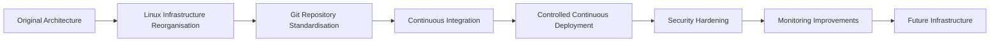

# Infrastructure Upgrade

This document describes the evolution of the original production environment into a more maintainable and scalable infrastructure.

Rather than redesigning the application itself, the objective was to improve how the infrastructure was organised, secured and operated.

---

## Upgrade Objectives

The infrastructure improvements focused on several engineering goals:

- Improve maintainability.
- Reduce manual operational work.
- Standardise deployments.
- Strengthen server security.
- Improve documentation.
- Prepare the project for future growth.

---

## Infrastructure Evolution

---

## Major Improvements

### Linux Infrastructure

- Reorganised application layout.
- Improved file ownership strategy.
- Better separation between user data and application services.

---

### Development Workflow

- Standardised Git workflow.
- Improved repository consistency.
- Reduced deployment preparation time.

---

### CI/CD

- Automated build validation.
- Controlled production deployment.
- Safer release process.

---

### Security

- SSH hardening.
- Fail2Ban deployment.
- PostgreSQL access improvements.
- Reduced attack surface.

---

### Operations

- Improved monitoring.
- Better troubleshooting documentation.
- Health verification procedures.
- Infrastructure investigation reports.

---

## Current Direction

The infrastructure continues to evolve toward a more production-ready platform while keeping operational complexity appropriate for a small engineering team.

Future improvements include:

- Infrastructure as Code
- Secrets management
- Automated database migrations
- Centralised monitoring
- Backup automation
- Cloud service integration

---

## Related Documentation

| Document | Description |
|----------|-------------|
| Building a Reliable CI Pipeline |
| Controlled Production Deployment |
| Linux Infrastructure Reorganisation |
| Production API Migration | Docker migration |
| PostgreSQL Hardening | Database security improvements |
| SSH Hardening | Server security |
| Monitoring Investigations | Operational improvements |
